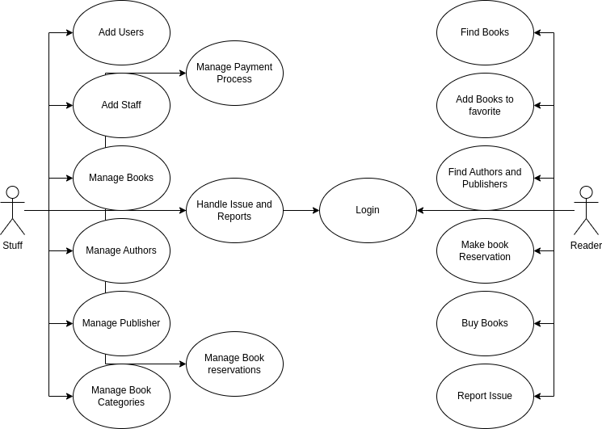

# library-manegement-system-v1

A library management system (LMS) is a software solution designed to automate and streamline the operations of a library. It serves as a centralized platform that helps librarians and library staff to efficiently manage various tasks related to cataloging, circulation, acquisitions, and more.

The primary purpose of an LMS is to enhance the overall efficiency and effectiveness of library operations. Here are some reasons why people use library management systems

## Targeted Audience

our app is design to be used by :

- the library staff member
- the people how love to read

## Features

### Staff

the staff can :

- add user to the system
- add other staff member
- add, update, delete books to/from the library
- add, update, delete authors to/from the library
- add, update, delete publisher to/from the library
- manage book reservation
- manage the payment process of the book
- handle the issue and reports of the user

### Reader

and our reader can :

- find books to read
- add books to favorite
- find his favorite authors and Publishers
- make book reservation
- buy books
- report an issue or a problem

## use case diagram

and here is a use case diagram that show each user what he can do

## ERD

you can find the erd inside the extra and open them insid [mysql workbench](https://www.mysql.com/products/workbench/)

## setting up

before you start make sure you have

- node js, you can check that using `node -v`
- mysql database running on your device

### now to start you should

- run `npm i` to install the required library
- go to config folder and rename the  example.env to .env and set up your database credential and add your own JWT secret
- now create the mysql database with the name of the .env variable `DB_NAME`
- and run `npm run m` to migrate and `npm run seed` to seed   `npm run start` and the server will run on `http://localhost:3000/`
- if you are using [postman](https://www.postman.com/) you can import the collection inside the `extra/collection` to see the request collection
